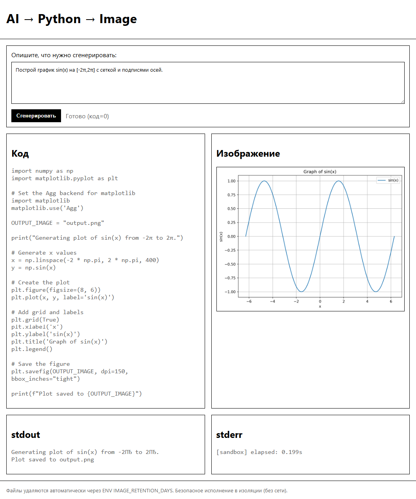

# CodeRunnerGPT



# Запуск локально

### Подготовка окружения:
* Установите Docker и Python 3.11+.
* Сохраните файлы проекта в один каталог, как описано выше.
* Задайте GEMINI_API_KEY.
* Соберите sandbox-образ:
* * **В корне проекта выполните:**
* * **Linux:** ```cp sandbox_runner.py sandbox/```
* * **Windows:** ```copy sandbox_runner.py sandbox\```
* * ```docker build -t python-sandbox:latest sandbox```

### Установите зависимости и запустите сервер:
```bash
python -m venv .venv && . .venv/bin/activate
pip install -r requirements.txt
python app.py
```
Откройте [http://localhost:8000](http://localhost:8000)

# Примечания:
* В разработке можно отключить Docker (USE_DOCKER=false в .env); тогда раннер запускается локально (меньше изоляции — только для отладки).
* Для продакшена используйте процесс‑менеджер (gunicorn/uvicorn+ASGI‑обёртка, reverse proxy) и убедитесь, что Docker доступен серверу.
* Если matplotlib потребует дополнительные runtime‑библиотеки (редко), добавьте их в Dockerfile (libtiff5, zlib1g и т.п.).